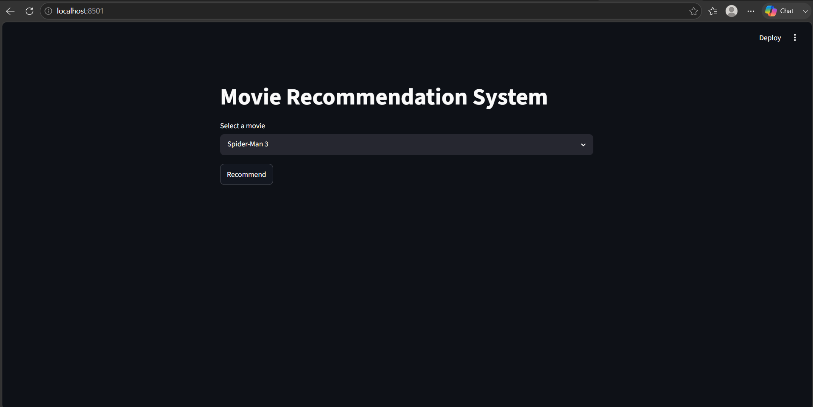
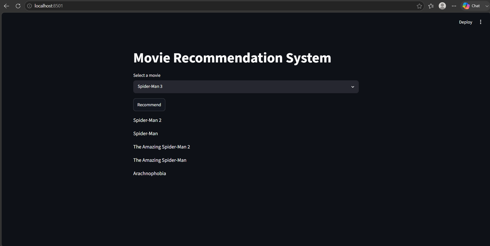
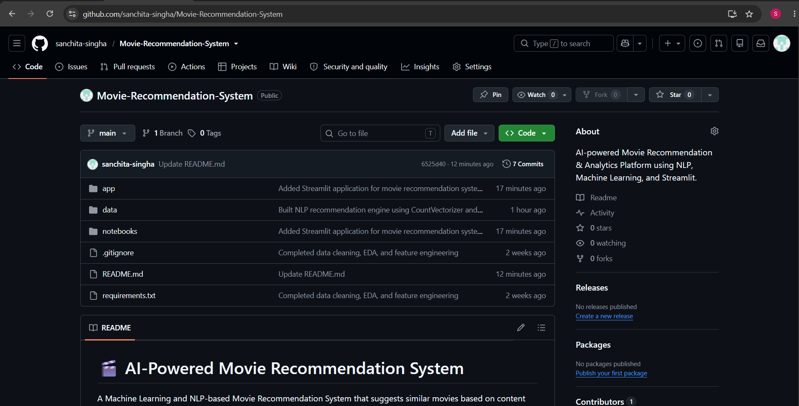

# 🎬 AI-Powered Movie Recommendation System

A Machine Learning and NLP-based Movie Recommendation System that suggests similar movies based on content features such as genres, keywords, cast, crew, and movie overview.

The project combines Data Analysis, Feature Engineering, Natural Language Processing, Machine Learning, and Streamlit to build an end-to-end recommendation engine.

---

## 🚀 Project Overview

This project uses content-based filtering to recommend movies similar to a selected movie.

The recommendation engine is built using:

- CountVectorizer (Bag of Words)
- Cosine Similarity
- Feature Engineering
- NLP Text Processing
- Streamlit Web Application

---

## 📊 Dataset

Dataset used:

- TMDB Movies Dataset
- movies.csv
- credits.csv

The datasets were merged and cleaned before analysis and model building.

---

## 🔍 Exploratory Data Analysis (EDA)

Performed analysis on:

### Genre Analysis
- Most common genres
- Genre distribution

### Rating Analysis
- Rating distribution
- Average movie ratings

### Popularity Analysis
- Most popular movies
- Popular genres

### Time Analysis
- Movie release trends

### Cast & Director Analysis
- Most frequent actors
- Most successful directors

### Correlation Analysis
- Relationship between movie features

Visualizations were created using:

- Matplotlib
- Seaborn
- Plotly

---

## ⚙️ Feature Engineering

Features extracted from:

- Overview
- Genres
- Keywords
- Cast
- Crew

### Processing Steps

- Converted JSON columns into usable lists
- Extracted top actors
- Extracted director names
- Removed spaces from names
- Created a unified **tags** column

Example:

```
overview + genres + keywords + cast + director
```

---

## 🤖 Recommendation Engine

### NLP Technique

Bag of Words using:

```python
CountVectorizer(max_features=5000, stop_words='english')
```

### Similarity Measurement

```python
Cosine Similarity
```

The similarity matrix is used to identify the most relevant movies for a given movie.

---

## 🖥️ Streamlit Application

Features:

✅ Movie Recommendation

✅ Search Movies

✅ Interactive UI

✅ Fast Recommendation Engine

Users can:

1. Select a movie
2. Click Recommend
3. Get Top Similar Movies

---

## Screenshots

### Home Page


### Recommendation Result


### GitHub Repository



## 🛠️ Tech Stack

| Technology | Purpose |
|------------|----------|
| Python | Programming |
| Pandas | Data Processing |
| NumPy | Numerical Operations |
| Matplotlib | Visualization |
| Seaborn | Visualization |
| Plotly | Interactive Charts |
| Scikit-Learn | Machine Learning |
| CountVectorizer | NLP |
| Cosine Similarity | Recommendation Engine |
| Streamlit | Web Application |
| Pickle | Model Serialization |
| Git & GitHub | Version Control |

---

## 📂 Project Structure

```
Movie-Recommendation-System/
│
├── app/
│   └── app.py
│
├── data/
│   ├── clean_movies.csv
│   └── feature_engineered_movies.csv
│
├── notebooks/
│   ├── 01_data_cleaning.ipynb
│   ├── 02_eda.ipynb
│   ├── 03_feature_engineering.ipynb
│   └── 04_recommendation_system.ipynb
│
├── models/
│   ├── movie_dict.pkl
│   ├── movies.pkl
│   └── similarity.pkl
│
├── requirements.txt
├── README.md
└── .gitignore
```

---

## 📈 Workflow

1. Data Cleaning
2. Exploratory Data Analysis
3. Feature Engineering
4. Tags Creation
5. NLP Processing
6. Vectorization using CountVectorizer
7. Cosine Similarity Calculation
8. Recommendation Generation
9. Streamlit Deployment

---

## ▶️ Run Locally

Clone repository:

```bash
git clone https://github.com/sanchita-singha/Movie-Recommendation-System.git
```

Install requirements:

```bash
pip install -r requirements.txt
```

Run Streamlit:

```bash
streamlit run app/app.py
```

---

## ⚠️ Note

Large model files (`.pkl`) may not be included in the repository because of GitHub file size limitations.

Generate them locally by running:

```text
04_recommendation_system.ipynb
```

---

## 🎯 Future Improvements

- Movie Poster Integration
- TMDB API Integration
- Hybrid Recommendation System
- Rating Prediction Model
- Popularity Prediction Model
- Streamlit Cloud Deployment
- Advanced Dashboard

---

## 👩‍💻 Author

**Sanchita Singha**

B.Sc. Data Science  
Techno India University

GitHub: https://github.com/sanchita-singha

---
⭐ If you found this project useful, consider giving it a star.
